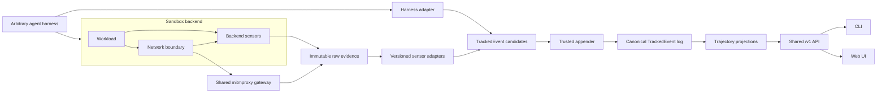

# Harness trajectory architecture

This document describes the system boundary and data contracts. Current
delivery status and acceptance tasks live in [tasks.md](tasks.md). The
conversation event semantics remain in [trackedEvents.md](trackedEvents.md);
Go types and pinned JSON Schemas define their wire shapes.

## Purpose and current boundary

The platform runs agent harnesses on interchangeable execution backends and
turns their actions and observed effects into one replayable trajectory. Its
automation surface is a non-interactive Go CLI. The CLI and web UI consume the
same versioned `/v1` control-plane API.

Today the control plane persists runs, appends lifecycle TrackedEvents, and
exports development-signed evidence. Mock and local-process normalizers prove
parts of the pipeline. The gVisor backend now captures best-effort raw system
and network evidence, including SecCheck frames and a mitmproxy flow archive.
It does **not** yet parse those sources into system/network TrackedEvents. Its
completed run log contains lifecycle events, while detailed observations
remain in raw records and artifacts. Neither the local-process nor gVisor
backend supports verified execution.

The next useful result is an evidence-linked trajectory view built from those
existing captures. A first pass can normalize a retained run into a derived
analysis log. Once the mapping and view work on a representative run, the
same normalization can move into run completion and the shared API. Complete
capture, admission, and independent verification are later work.

The target claim is bounded by a declared capability profile: every external
interaction mediated by the backend is observed by a measured sensor, and
every raw observation is represented by a normalized event or an explicit
hash-linked batch. Loss, unsupported paths, and bypass attempts are recorded
and affect eligibility. This claim does not include private in-memory
computation or every CPU instruction. The current gVisor capture does not
meet that target claim.

## End-to-end shape

The harness adapter translates conversation and tool intent from any
supported harness. A sandbox backend runs the workload and supplies its own
system, file, resource, and network sensors. Every sandbox backend integrates
the shared mitmproxy gateway for traffic it can route through the proxy;
backend sensors also observe the network boundary independently. Sensor
adapters decode retained evidence into the common TrackedEvent vocabulary.
The trusted appender alone assigns global sequence numbers, and trajectory
projections read the resulting log. The diagram is a target integration shape,
not a claim that today's gVisor captures are fully normalized or complete.

Raw collection comes before interpretation. Decoders preserve what was
observed, report unsupported or malformed input, and never assign global
sequence numbers. Projections read the event log; they do not rewrite source
facts. The first gVisor trajectory may be derived from retained evidence,
leaving the already sealed run log intact until live integration is ready.

## Canonical data contracts

| Layer | Contract | Key rule |
| --- | --- | --- |
| Raw sensor data | `internal/evidence.RawRecord`, `schemas/evidence/` | Source-owned sequence and hash chain; exact payload retained. |
| Captured files | Artifact entries in the evidence bundle | Artifact digest binds bytes such as `gateway-flows.mitm` and pcap files. |
| Trajectory | `pkg/events.TrackedEvent`, `schemas/tracked-events/` | One gap-free `seq` assigned by the trusted appender. |
| Observation payload | `pkg/events.ObservationData` | Source, observation time, details, and evidence reference accompany each observed fact. |
| Provider projection | `schemas/openai-chat-completions-v1/` | Provider-native request/response bytes remain authoritative. |
| Run access | `schemas/control-api/` | CLI and web use the same `/v1` operations. |

### TrackedEvent envelope

The wire envelope is `{seq, time, type, data, ignorable?, sourceEventSeqs?,
surfaceOp?}` ([`pkg/events/events.go`](../pkg/events/events.go)). `seq` is
gap-free, strictly increasing, and assigned only by the run's trusted
appender. `time` is append time in Unix milliseconds. `data` carries the
event-specific payload. Observation-backed event types set `ignorable: true`
so older conversation replayers can skip them.

`sourceEventSeqs` lists earlier TrackedEvent sequence numbers, never raw
sensor sequence numbers. `surfaceOp` is the conversation-surface operation:
`"append"` or `{"op":"replace","start":...,"end":...}`. System and network
events do not modify that surface. Appended events are immutable; a correction
is a new event that identifies the earlier event.

### Observation payload and identities

Every sensor-derived fact has `ObservationData
` in `data`:

| Field | Meaning |
| --- | --- |
| `runId` | Owning run. |
| `source` | Sensor ID/type, backend/version, boot ID, source sequence, and trust domain. |
| `observation` | Native monotonic and wall times when present, clock ID, and collector receipt time. |
| `subject` | Optional process/parent, executable identity, and actor. |
| `outcome` | Optional result, errno, code, and message. |
| `correlation` | Optional flow, TLS, HTTP, model, MCP, tool-call, and trace IDs. |
| `evidence` | Raw record digest, stream and source range, normalizer digest/version, observation layer/method. |
| `details` | Type-specific observed data; see Go type and JSON Schema for wire validation. |

The source key `(sensorId, bootId, sourceSeq)` makes ingestion idempotent.
The raw reference is in `data.evidence`, not `sourceEventSeqs`. Logical
`processId`, `fileId`, `pipeId`, `socketId`, `flowId`, `tlsSessionId`,
`httpRequestId`, `modelExchangeId`, `mcpSessionId`, and `toolCallId` are
run-scoped. Native PIDs, descriptors, inodes, ports, and provider IDs stay in
details because they can be reused or collide.

### Raw record and artifact boundary

A `RawRecord` contains `runId`, `sensorId`, `bootId`, `sourceSeq`,
optional observed times, `recordType`, `encoding`, exact `payload`,
`previousRecordSha256`, and `recordSha256`. Its digest covers the
deterministic binary frame, not reserialized JSON. Each source has a separate
sequence and hash chain seeded from the run specification, observation plan,
and source identity. A sensor restart uses a new boot ID and source chain.
Sequence gaps, drops, truncation, and parse failures are health facts.

Large captures such as pcap, snapshots, and `gateway-flows.mitm` are artifacts.
Their raw records identify the artifact and digest; the bytes live in the
bundle. An event derived from part of an artifact also needs a locator for
the exact item or byte range. The archive-flow locator needed for mitmproxy
normalization is part of the current design work.

### Backend lifecycle, capabilities, and plan

[`pkg/backend.ExecutionBackend`](../pkg/backend/contracts.go) owns
`Describe`, `Prepare`, `Start`, `Wait`, `Stop`, `Snapshot`,
`FinalizeEvidence`, and `Destroy`. The backend manages the workload and
collects raw evidence. It does not assign TrackedEvent `seq` or define a
private public trajectory format. Cleanup follows collection and drain, or
an explicit record that drain failed.

`CapabilityManifest` states each event family's observation level,
enforcement level, retention, backend/version, and trust domain.
`ObservationPlan` resolves run requirements against those capabilities
before execution. A requirement names an event family, minimum observation
and enforcement levels, retention, and whether it is required for verified
execution. The plan also records sensor configuration, plaintext and
destination-preservation requirements, and opaque-traffic policy.

Observation levels are `complete`, `conditional`, `best_effort`,
`sampled`, `aggregated`, and `unsupported`. Enforcement levels are
`synchronous`, `eventual`, `audit_only`, and `unsupported`.
Observation does not imply enforcement. `SensorHealth` records actual
source ranges, gaps, drops, saturation, parse failures, opaque flows, and
start/drain/stop state. Capability describes what a backend can do; plan
describes what this run requested; health describes what happened.

### Event vocabulary

[`trackedEvents.md`](trackedEvents.md) owns the existing conversation
vocabulary. The observation extensions use these slash-delimited types
([`pkg/events/validation_helpers.go`](../pkg/events/validation_helpers.go)):

- **Conversation:** `turn/start`, `turn/end`, `user/message`,
  `request/header`, `request/context`, `llm/retry`, `step/start`,
  `assistant/chunk`, `assistant/message`, `step/end`, `tool/call`,
  `tool/result`, `compaction/*`, `session/end-seed`.
- **Run and backend:** `run/start`, `run/observation-plan`,
  `backend/prepared`, `backend/started`, `backend/stopped`,
  `backend/snapshot`, `run/finish`.
- **Sensor health:** `sensor/start`, `sensor/heartbeat`, `sensor/stop`,
  `sensor/restart`, `sensor/gap`, `sensor/drop`, `sensor/saturation`,
  `sensor/parse-failure`, `sensor/clock-skew`, `sensor/bypass-attempt`.
- **Process and system:** `process/create`, `process/exec`, `process/exit`,
  `process/signal`, `process/credential-change`, `resource/sample`,
  `policy/decision`, `system/log`, `stdio/chunk`.
- **Filesystem and IPC:** `file/open`, `file/read`, `file/write`,
  `file/close`, `file/rename`, `file/delete`, `file/metadata-change`,
  `file/executable-map`, `file/snapshot-diff`; `ipc/pipe-create`,
  `ipc/read`, `ipc/write`, `ipc/unix-connect`, `ipc/unix-accept`,
  `ipc/shared-memory`.
- **Network and protocol:** `dns/query`, `dns/response`,
  `network/socket-create`, `network/bind`, `network/listen`,
  `network/connect`, `network/accept`, `network/flow-open`,
  `network/flow-update`, `network/flow-close`, `network/plaintext`,
  `network/plaintext-failure`, `network/packet-batch`,
  `network/route-decision`, `tls/session`, `http/request`, `http/response`.
- **Provider and MCP:** `model/request`, `model/stream-chunk`,
  `model/response`, `model/usage`, `mcp/request`, `mcp/response`,
  `mcp/notification`, `mcp/tool-call`, `mcp/tool-result`.
- **Benchmark and evidence:** `benchmark/start`, `benchmark/finish`,
  `verifier/start`, `verifier/result`, `artifact/created`,
  `evidence/checkpoint`, `evidence/sealed`.

The vocabulary names possible normalized facts, not a claim that every
backend currently observes all of them. `stdio/chunk` is workload output,
while `system/log` is runtime or sensor output with a declared trust domain.
`file/snapshot-diff` describes a before/after difference, not each file
operation. `network/packet-batch` can summarize packet metadata with a
source range, count, byte count, time bounds, flow IDs, and digest; it never
replaces plaintext. `model/*` describes observed remote exchange; the
conversation's `request/*` and `assistant/*` retain their own meanings.
`mcp/tool-call` is a protocol effect; `tool/call` is intent.

## Portable network and provider contracts

### Shared mitmproxy gateway

Use [mitmproxy](https://docs.mitmproxy.org/stable/) as the common protocol
gateway for **all sandbox backends**. The sandbox adapter owns how traffic
reaches a per-run gateway and how the original destination is preserved. Use
mitmproxy's existing [proxy modes](https://docs.mitmproxy.org/stable/concepts/modes/)
as appropriate to that backend: regular proxy plus DNS mode is the current
gVisor path; transparent, WireGuard, TUN, or other modes are candidates where
their routing and platform limits fit. A backend must declare which flows
actually reach the gateway and reconcile them with its independent boundary
sensor. Merely configuring a proxy does not establish complete coverage.

The shared gateway should use mitmproxy's tooling before adding custom capture
code:

- Run the headless `mitmdump` frontend and retain its native flow archive as
  immutable evidence. Pin the mitmproxy build and archive reader version.
- Use native [filter expressions](https://docs.mitmproxy.org/stable/concepts/filters/)
  for read-only inspection and derived views: `~http` and `~dns` separate
  protocols; `~d`, `~src`, and `~dst` narrow endpoints; `~m` and `~c` narrow
  HTTP methods and status codes; `~e` and `~q` expose errors and unanswered
  requests. Expressions can combine with `!`, `&`, `|`, and parentheses.
  Record the expression and mitmproxy version with any saved filtered view.
  Filtering must not discard flows from the authoritative archive or silently
  exclude them from normalization and coverage accounting.
- Use mitmproxy's HTTP, WebSocket, DNS, and supported generic TCP/UDP
  [protocol handling](https://docs.mitmproxy.org/stable/concepts/protocols/)
  when the selected mode can carry those flows. Record the actual protocol,
  mode, and capture outcome rather than assuming support for every transport.
- Use its [certificate authority and interception facilities](https://docs.mitmproxy.org/stable/concepts/certificates/)
  for TLS traffic whose clients trust the run's CA. Keep CA material scoped to
  the run and protected as sensitive evidence. Failed interception, pinning,
  and opaque traffic remain explicit coverage outcomes.
- Decode the archive with mitmproxy's maintained
  [flow reader](https://docs.mitmproxy.org/stable/addons/examples/) or a pinned
  exporter built on it. A small [addon](https://docs.mitmproxy.org/stable/addons/overview/)
  may expose stable flow IDs, timestamps, endpoints, message fields, and body
  bytes needed by the sensor adapter. Preserve the native flow and an exact
  artifact/flow locator behind each derived event. Use built-in replay and
  inspection only for diagnostics and tests, never as observed workload
  traffic in a benchmark run.

The gateway's output is proxy-visible evidence, not the whole network truth.
HTTP messages in a flow archive need not preserve the original on-wire byte
stream, and traffic that bypasses the proxy is absent. The `network/plaintext`
contract below still requires exact bytes and boundary reconciliation.
Coverage and eligibility depend on the backend's routing, independent sensor,
and health record, including unsupported protocols and proxy failures. The
current gVisor `gateway-flows.mitm` is the first input for this shared decoder;
other backends should produce the same logical evidence and event contracts.

### Boundary observation and plaintext

A backend's network sensor records socket/connection lifecycle, DNS, loopback
where observable, flow endpoints, ownership when provable, packet/byte
counters, and policy decisions. An independent host veth, TAP, or equivalent
boundary sensor corroborates external crossings. Packet capture supplies
transport context and coverage checks, not decrypted content.

All backends use the same `NetworkPlaintext` details shape for
`network/plaintext` ([`pkg/events/events.go`](../pkg/events/events.go)):

| Fields | Meaning |
| --- | --- |
| `boundary`, `capturePoint` | Named boundary (normally `sandbox`) and component that obtained plaintext. |
| `connectionId`, `streamId`, `transport` | Stable connection/stream identity and TCP, UDP, QUIC, or other transport. |
| `direction`, `sequence`, `offset`, `endOfStream` | Ingress/egress relative to the boundary; chunk or datagram order and completion. |
| `source`, `destination`, `protocol` | Endpoint IP/port/hostname and decoded protocol identity. |
| `payload` | Inline bytes or immutable artifact slice, encoding, exact length, and SHA-256. |
| `capture` | Method, backend, original security protocol, optional key-material digest, and capture-verification state. |

For streams, reconstruct by `(boundary, connectionId, streamId, direction,
sequence, offset)`; datagrams are individually ordered records. Count and
hash the exact plaintext bytes before JSON encoding. Retransmissions and
packet fragmentation must not duplicate application bytes. Redacted public
views are derived from protected evidence; they cannot replace the
authoritative captured bytes.

Acquisition may use destination-preserving TLS interception, session-key
reconstruction, pre-encryption/post-decryption instrumentation, measured
guest capture, or direct capture of natively plaintext protocols. The method
and supported protocols belong in capability data. A verified profile
requires complete plaintext and original destination preservation for every
allowed boundary flow. Unknown encryption or an opaque connection must be
denied or make the run ineligible. The current proxy archive does not satisfy
this complete-boundary contract.

### Provider-native exchange and normalized model events

The harness retains its chosen provider endpoint, SDK, credentials, request
format, and response format. The platform observes the native exchange and
then projects supported shapes into pinned
`openai.chat-completions.v1` `model/request`, `model/stream-chunk`,
`model/response`, and `model/usage` events. `OpenAICompatibleExchange`
carries the schema ID, provider/model, endpoint, optional provider request
ID, run-scoped model exchange ID, schema-validated body, and namespaced
extensions. The native bytes remain the audit source; a projection is not a
replacement provider endpoint. Unsupported, partial, or invalid exchanges
keep their raw evidence and have an explicit decode result.

Each physical provider request has at most one authoritative usage record;
retries are separate requests even if they share a logical exchange. Usage
fields are nullable input, output, cache-read, cache-write, reasoning, and
total tokens. Each has a quality value:
`provider_reported`, `derived_from_provider_reported`,
`harness_reported`, `client_estimated`, or `unavailable`.
Missing values stay missing, never zero or silently estimated. Provider
reported figures are authoritative for billing analysis.

## Current capture inputs and first mapping

| Input retained by gVisor | Source of record | Initial interpretation |
| --- | --- | --- |
| `seccheck/frame` | Length-framed protobuf payload in a chained raw record | Decode supported process, file, IPC, and socket observations. |
| `gateway/flow` | Chained artifact record plus `gateway-flows.mitm` bytes | Decode proxy-visible DNS/HTTP exchanges and body bytes; identify each archive flow. |
| `runsc/log` | Retained runtime log artifact | Diagnostic context, not a substitute for structured SecCheck facts. |
| `gateway/view`, `dns/log` | Rendered text artifacts | Human preview only; not an authoritative source for event bodies or byte counts. |
| `network/packet` and network configuration | Pcap and configuration artifacts | Independent transport context; payload does not establish TLS plaintext. |
| stdout/stderr, resource samples, snapshots, health | Raw records and artifacts | Workload output, resource, filesystem-state, and capture-quality context. |

The SecCheck decoder should use the pinned message schema, preserve native
timestamps and identifiers, and emit only supported event types. Unknown
message kinds, incomplete fields, and damaged frames must remain visible as
decode outcomes. Debug text must not be parsed to invent a more certain
syscall history.

The mitmproxy decoder should use a pinned archive reader and identify the
archive artifact, flow ID, and request/response component behind each
observation. The current `gateway/flow` raw record contains artifact metadata,
not the flow bytes themselves. An HTTP or DNS event therefore needs both the
raw record reference required by `ObservationData` and a locator into the
bound archive. If the existing payload cannot express that locator cleanly,
extend the event/schema contract together. Preserve method, URL/authority,
status, headers, timestamps, and captured body bytes where available. An
absent response or unsupported flow stays absent or unsupported.

`network/plaintext` has a stricter meaning than an HTTP event. It represents
the exact captured plaintext byte sequence, with direction, stream ordering,
byte count, hash, endpoints, and capture method. The mitmproxy archive can
support useful HTTP semantics without necessarily retaining the original
on-wire byte stream. Do not reserialize an HTTP message or use
`gateway-plaintext.txt` to manufacture a complete `network/plaintext`
stream. A proxy-visible flow is also not proof that all sandbox traffic passed
through the proxy.

For a first trajectory, keep the mapping intentionally small: observed
process and file operations; proxy-visible HTTP request/response and DNS
facts; source-health gaps. Add vocabulary only when an input can substantiate
it. `internal/llmnormalizer` already handles selected mock provider shapes,
but production model events wait for a provider-native decoder fed by
captured exchanges.

## Producing the first view

A decoder returns typed observations or unsequenced TrackedEvent candidates.
A trusted appender supplies `seq` and append time. For the first retained-run
prototype, a separate derived log can be built without changing a sealed
bundle. Later, gVisor completion should collect the raw inputs, normalize
them, append the candidates, and only then finish the canonical log. These
are two stages of the same mapping, with the first stage optimized for
examining real output.

### Reusing DeepSeek Harness trajectory code

The conversation TrackedEvent vocabulary originates in
[DeepSeek Harness](https://github.com/deepseek-ai/deepseek-harness). Use its
[trajectory UI package](https://github.com/deepseek-ai/deepseek-harness/tree/46a7f68b0922371ce7144b668b90e377d8e799f4/packages/client/ui-trajectory)
as the starting point for the web trajectory view. Its event projection and
snapshot builder assemble conversation records; its layout, ledger, timeline,
inspector, search index, and virtual-row code provide reusable presentation
behavior. Pin the upstream revision used and retain the upstream MIT license
notice for copied code.

An adapter must feed that view from this project's canonical `/v1` event and
evidence data. Preserve `seq` as the record identity and replay order, while
displaying observation time separately. Extend the upstream conversation-only
record kinds and inspector for process, file, network, HTTP/DNS, sensor-health,
and evidence-link rows; unsupported events remain visible as typed fallback
rows. A selected observation should open its exact raw frame or archive flow.
Keep projection rules in the shared `/v1` path so the CLI can report the same
facts. The upstream package is a React/Cordis client plugin and is not a
drop-in replacement for the current dependency-free `web/` page or the Go
projection; adapt the useful components without changing event authority.

The initial projection is a timeline with:

- canonical sequence and observed time;
- event type, source, and concise operation/result;
- process or flow identity where known;
- capture-quality or parse-failure state; and
- a path from the event to the exact SecCheck frame or mitmproxy archive flow.

Filters by process, flow, event type, and time make the view useful before
tool-to-effect correlation exists. A `/v1` query should return the same
trajectory and evidence links to CLI and web consumers. Views can regroup or
sort events but must retain canonical sequence and never alter the raw facts.

A parsing failure is data about coverage. Keep the original bytes, record
which decoder and source failed, and show the gap in the view. Do not fill
unknown timestamps, identities, bodies, or operations with guesses. The
first view is a development analysis product, not a verified-execution claim.

## Ordering and correlation across sources

Global `seq` is durable replay order. A sensor's `sourceSeq` preserves only
its own order. Raw bytes should be durable before their normalized events
are appended. Late observations append at the tail; the event log is not
rewritten to create a false global clock order. A timeline may use
observation time for display while retaining `seq`, source order, clock ID,
and recorded skew. Finalization waits for required sources to stop and drain,
or records which source did not drain.

Correlation is a derived link or index, never an edit to a source event.
Use evidence in descending strength: explicit trace/tool/HTTP/provider IDs;
socket, flow, descriptor, or pipe ownership; process lineage; content or
artifact hash; then bounded time proximity. A link records its method,
confidence, source event sequences, relevant raw IDs, timing distance, and
correlator version. Temporal coincidence alone is not a causal fact.

## Trust, policy, and evidence lifecycle

Observation and enforcement are different. A policy decision is made at the
boundary that owns the operation: network destinations at the backend
network layer, process and file operations at Sentry/guest/LSM hooks,
resource limits at cgroups or backend limits, and plaintext content at the
capture layer. A `policy/decision` event records the attempted operation and
policy artifact identity. Development runs may continue with degraded
capture; a profile that requires complete observation must reject missing
capability before start or mark runtime loss explicitly.

A completed workload is not automatically an admitted benchmark run.
The bundle is the portable audit object. Its logical contents are the run
specification and observation plan; capability and sensor-health documents;
the TrackedEvent log and chain; independent raw source chains; captured
artifacts and their digests; verification report; and a signed evidence
manifest. Exact filenames may vary by implementation, but bundle paths and
hashes are checked on import. The present local Ed25519 key is for
development integrity, not public trust.

A full verifier ultimately checks, in order: source drain/health; raw and
event chain continuity; coverage of raw ranges by normalized or batch
events; artifact and normalizer digests; plaintext/boundary reconciliation;
capability and policy eligibility; and a signature under a configured trust
root. It must be able to reproduce its decision from an exported bundle
without trusting the control plane's earlier status.

Collector loss, overflow, incomplete drains, parser failures, and unsupported
protocols are explicit health outcomes. Preserve the available raw evidence
and workload result even when the trajectory is incomplete. A failed decoder
cannot silently yield a clean view. For required capture, policy determines
whether execution stops or completes as ineligible. A changed retained byte
invalidates its digest; a valid digest alone does not prove that a sensor saw
every operation.

## Backend-specific acquisition

| Backend | System observation | Network and plaintext acquisition |
| --- | --- | --- |
| gVisor | Sentry/SecCheck process, filesystem, signal, IPC; runsc/Gofer logs and host resource data. | Netstack and host veth observation; destination-preserving gateway or other supported plaintext tap. |
| Firecracker | Measured guest collector using tracepoints, eBPF, audit, or equivalent; guest output and logs. | Guest plaintext tap plus independent host TAP capture. |
| Kata VM | Measured guest collector and protected log channel. | Guest plaintext tap plus host veth/TAP corroboration. |
| Native container | Cgroup-aware eBPF/LSM and runtime/kernel logs. | Namespace/veth capture plus supported TLS hooks, key reconstruction, or transparent acquisition. |

These are target acquisition patterns, not claims about implemented backends.
A backend can share the event vocabulary and bundle format while offering a
different isolation or trust level. Capability and health documents keep
those differences visible. The current gVisor capture is narrower than its
target row: SecCheck frames and proxy flows are retained, while Netstack
coverage and complete plaintext are future work.

## Product and repository boundaries

The CLI exposes non-interactive run, trajectory, evidence, result, backend,
and schema operations with structured JSON/JSONL output and stable exit
codes. The web UI uses the same `/v1` control-plane operations for setup,
live status, timeline exploration, evidence inspection, and comparison.
Neither surface gets a private execution or verification path.

`pkg/backend` and `pkg/events` hold public contracts;
`internal/backend` owns backend adapters; `internal/evidence` retains
raw inputs; `internal/normalizer` and `internal/llmnormalizer` derive
events; `internal/appender` owns global order; `internal/projection`
builds views; `internal/controlplane` and `internal/api` serve runs.
`schemas/` pins wire contracts and `testdata/golden/` holds deterministic
fixtures. A changed public event or payload updates Go types, schema,
fixtures, and compatibility checks together.

## Later completeness and verification contract

A verified profile requires more than successful parsing:

1. Every required sensor starts, stays healthy, accounts for loss, drains,
   and reports its actual coverage.
2. Every allowed boundary flow has complete destination-preserving
   plaintext in both directions, or the connection is denied. Ciphertext and
   packet metadata cannot replace plaintext.
3. Network plaintext reconstructs gap-free by connection, stream, direction,
   sequence, and offset, and reconciles with independent boundary accounting.
4. Provider-native exchanges can be audited against their pinned
   OpenAI-compatible `model/*` projections. Only provider-reported usage is
   authoritative; missing fields stay missing.
5. The exported bundle binds raw records, artifacts, event chain, capability
   and health documents, and normalizer identities. A verifier checks these
   from the bundle using a configured trust root before admission.

The current gVisor gateway observes traffic routed through mitmproxy.
Startup veth gaps, direct IP/DNS traffic, proxy bypass, certificate pinning,
QUIC, custom protocols, and opaque encryption prevent a complete-network
claim. Future gVisor work needs stronger Sentry/Netstack coverage, independent
host-boundary observation, loss accounting, and enforcement. A later second
backend should emit the same logical event and plaintext contracts while
declaring its own sensor and isolation limits.

## Design decisions

- The TrackedEvent log is the single public trajectory; backend-native logs
  remain raw evidence, not a competing event schema.
- The trusted appender owns global order. Sensors own only source order.
- Observation time and append time are distinct.
- Exact raw input remains available after decoding; normalized events and
  views are derived and versioned.
- Intent and effects remain distinct. Correlation adds links, never changes
  recorded source facts.
- CLI and web share `/v1`; neither has private run semantics.
- A useful trajectory is the immediate milestone. Complete coverage and
  verified admission require separate evidence and acceptance work.
